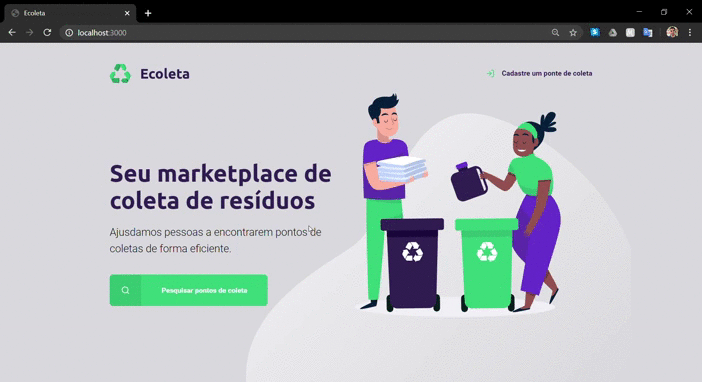

          
  <a aria-label="Repositórios Git" href="https://github.com/LucasPires50">
    </img>
  </a>
  <a aria-label="LinkedIn" href="https://www.linkedin.com/in/lucas-albuquerque-pires-87b403a5/">
    </img>
  </a>
  

<h1><a id="user-content-índice" class="anchor" aria-hidden="true" href="#índice"><svg class="octicon octicon-link" viewBox="0 0 16 16" version="1.1" width="16" height="16" aria-hidden="true"><path fill-rule="evenodd" clip-rule="evenodd" d="M7.775 3.275C7.64252 3.41717 7.57039 3.60522 7.57382 3.79952C7.57725 3.99382 7.65596 4.1792 7.79337 4.31662C7.93079 4.45403 8.11617 4.53274 8.31047 4.53617C8.50477 4.5396 8.69282 4.46748 8.835 4.335L10.085 3.085C10.2708 2.89918 10.4914 2.75177 10.7342 2.65121C10.977 2.55064 11.2372 2.49888 11.5 2.49888C11.7628 2.49888 12.023 2.55064 12.2658 2.65121C12.5086 2.75177 12.7292 2.89918 12.915 3.085C13.1008 3.27082 13.2482 3.49142 13.3488 3.7342C13.4493 3.97699 13.5011 4.23721 13.5011 4.5C13.5011 4.76279 13.4493 5.023 13.3488 5.26579C13.2482 5.50857 13.1008 5.72917 12.915 5.915L10.415 8.415C10.2292 8.60095 10.0087 8.74847 9.76588 8.84911C9.52308 8.94976 9.26283 9.00157 9 9.00157C8.73716 9.00157 8.47691 8.94976 8.23411 8.84911C7.99132 8.74847 7.77074 8.60095 7.585 8.415C7.44282 8.28252 7.25477 8.21039 7.06047 8.21382C6.86617 8.21725 6.68079 8.29596 6.54337 8.43337C6.40596 8.57079 6.32725 8.75617 6.32382 8.95047C6.32039 9.14477 6.39252 9.33282 6.525 9.475C6.85001 9.80004 7.23586 10.0579 7.66052 10.2338C8.08518 10.4097 8.54034 10.5002 9 10.5002C9.45965 10.5002 9.91481 10.4097 10.3395 10.2338C10.7641 10.0579 11.15 9.80004 11.475 9.475L13.975 6.975C14.6314 6.31858 15.0002 5.4283 15.0002 4.5C15.0002 3.57169 14.6314 2.68141 13.975 2.025C13.3186 1.36858 12.4283 0.999817 11.5 0.999817C10.5717 0.999817 9.68141 1.36858 9.02499 2.025L7.775 3.275ZM3.085 12.915C2.89904 12.7292 2.75152 12.5087 2.65088 12.2659C2.55023 12.0231 2.49842 11.7628 2.49842 11.5C2.49842 11.2372 2.55023 10.9769 2.65088 10.7341C2.75152 10.4913 2.89904 10.2707 3.085 10.085L5.585 7.585C5.77074 7.39904 5.99132 7.25152 6.23411 7.15088C6.47691 7.05023 6.73716 6.99842 7 6.99842C7.26283 6.99842 7.52308 7.05023 7.76588 7.15088C8.00867 7.25152 8.22925 7.39904 8.415 7.585C8.55717 7.71748 8.74522 7.7896 8.93952 7.78617C9.13382 7.78274 9.3192 7.70403 9.45662 7.56662C9.59403 7.4292 9.67274 7.24382 9.67617 7.04952C9.6796 6.85522 9.60748 6.66717 9.475 6.525C9.14999 6.19995 8.76413 5.94211 8.33947 5.7662C7.91481 5.59029 7.45965 5.49974 7 5.49974C6.54034 5.49974 6.08518 5.59029 5.66052 5.7662C5.23586 5.94211 4.85001 6.19995 4.525 6.525L2.025 9.02499C1.36858 9.68141 0.999817 10.5717 0.999817 11.5C0.999817 12.4283 1.36858 13.3186 2.025 13.975C2.68141 14.6314 3.57169 15.0002 4.5 15.0002C5.4283 15.0002 6.31858 14.6314 6.975 13.975L8.225 12.725C8.35748 12.5828 8.4296 12.3948 8.42617 12.2005C8.42274 12.0062 8.34403 11.8208 8.20662 11.6834C8.0692 11.546 7.88382 11.4672 7.68952 11.4638C7.49522 11.4604 7.30717 11.5325 7.165 11.665L5.915 12.915C5.72925 13.1009 5.50867 13.2485 5.26588 13.3491C5.02308 13.4498 4.76283 13.5016 4.5 13.5016C4.23716 13.5016 3.97691 13.4498 3.73411 13.3491C3.49132 13.2485 3.27074 13.1009 3.085 12.915Z"></path></svg></a>Índice</h1>
<ul>
<li><a href="#sobre">Sobre</a></li>
<li><a href="#tecnologias-utilizadas">Tecnologias Utilizadas</a></li>
<li><a href="#Resultado-Web">Resultado Web</a></li>
<li><a href="#Resultado-Mobile">Resultado Mobile</a></li>
<li><a href="#ministrou">Quem ministrou as aulas?</a></li>
<li><a href="#comentario">Envie seu comentário!</a></li>
</ul>
<h2><a id="user-content-bookmark-sobre" class="anchor" aria-hidden="true" href="#bookmark-sobre"><svg class="octicon octicon-link" viewBox="0 0 16 16" version="1.1" width="16" height="16" aria-hidden="true"><path fill-rule="evenodd" clip-rule="evenodd" d="M7.775 3.275C7.64252 3.41717 7.57039 3.60522 7.57382 3.79952C7.57725 3.99382 7.65596 4.1792 7.79337 4.31662C7.93079 4.45403 8.11617 4.53274 8.31047 4.53617C8.50477 4.5396 8.69282 4.46748 8.835 4.335L10.085 3.085C10.2708 2.89918 10.4914 2.75177 10.7342 2.65121C10.977 2.55064 11.2372 2.49888 11.5 2.49888C11.7628 2.49888 12.023 2.55064 12.2658 2.65121C12.5086 2.75177 12.7292 2.89918 12.915 3.085C13.1008 3.27082 13.2482 3.49142 13.3488 3.7342C13.4493 3.97699 13.5011 4.23721 13.5011 4.5C13.5011 4.76279 13.4493 5.023 13.3488 5.26579C13.2482 5.50857 13.1008 5.72917 12.915 5.915L10.415 8.415C10.2292 8.60095 10.0087 8.74847 9.76588 8.84911C9.52308 8.94976 9.26283 9.00157 9 9.00157C8.73716 9.00157 8.47691 8.94976 8.23411 8.84911C7.99132 8.74847 7.77074 8.60095 7.585 8.415C7.44282 8.28252 7.25477 8.21039 7.06047 8.21382C6.86617 8.21725 6.68079 8.29596 6.54337 8.43337C6.40596 8.57079 6.32725 8.75617 6.32382 8.95047C6.32039 9.14477 6.39252 9.33282 6.525 9.475C6.85001 9.80004 7.23586 10.0579 7.66052 10.2338C8.08518 10.4097 8.54034 10.5002 9 10.5002C9.45965 10.5002 9.91481 10.4097 10.3395 10.2338C10.7641 10.0579 11.15 9.80004 11.475 9.475L13.975 6.975C14.6314 6.31858 15.0002 5.4283 15.0002 4.5C15.0002 3.57169 14.6314 2.68141 13.975 2.025C13.3186 1.36858 12.4283 0.999817 11.5 0.999817C10.5717 0.999817 9.68141 1.36858 9.02499 2.025L7.775 3.275ZM3.085 12.915C2.89904 12.7292 2.75152 12.5087 2.65088 12.2659C2.55023 12.0231 2.49842 11.7628 2.49842 11.5C2.49842 11.2372 2.55023 10.9769 2.65088 10.7341C2.75152 10.4913 2.89904 10.2707 3.085 10.085L5.585 7.585C5.77074 7.39904 5.99132 7.25152 6.23411 7.15088C6.47691 7.05023 6.73716 6.99842 7 6.99842C7.26283 6.99842 7.52308 7.05023 7.76588 7.15088C8.00867 7.25152 8.22925 7.39904 8.415 7.585C8.55717 7.71748 8.74522 7.7896 8.93952 7.78617C9.13382 7.78274 9.3192 7.70403 9.45662 7.56662C9.59403 7.4292 9.67274 7.24382 9.67617 7.04952C9.6796 6.85522 9.60748 6.66717 9.475 6.525C9.14999 6.19995 8.76413 5.94211 8.33947 5.7662C7.91481 5.59029 7.45965 5.49974 7 5.49974C6.54034 5.49974 6.08518 5.59029 5.66052 5.7662C5.23586 5.94211 4.85001 6.19995 4.525 6.525L2.025 9.02499C1.36858 9.68141 0.999817 10.5717 0.999817 11.5C0.999817 12.4283 1.36858 13.3186 2.025 13.975C2.68141 14.6314 3.57169 15.0002 4.5 15.0002C5.4283 15.0002 6.31858 14.6314 6.975 13.975L8.225 12.725C8.35748 12.5828 8.4296 12.3948 8.42617 12.2005C8.42274 12.0062 8.34403 11.8208 8.20662 11.6834C8.0692 11.546 7.88382 11.4672 7.68952 11.4638C7.49522 11.4604 7.30717 11.5325 7.165 11.665L5.915 12.915C5.72925 13.1009 5.50867 13.2485 5.26588 13.3491C5.02308 13.4498 4.76283 13.5016 4.5 13.5016C4.23716 13.5016 3.97691 13.4498 3.73411 13.3491C3.49132 13.2485 3.27074 13.1009 3.085 12.915Z"></path></svg></a><g-emoji class="g-emoji" alias="bookmark" fallback-src="https://github.githubassets.com/images/icons/emoji/unicode/1f516.png">🔖</g-emoji> Sobre</h2>

O <strong>Ecoleta</strong> é um projeto (aplicação web) construída durante a semana da <strong>Next Level Week</strong> .

A aplicação basea-se em um marketplace de coleta de resíduos, onde pessoas físicas e/ou jurídicas poderão cadastrar e/ou encontrar pontos de coleta em qualquer lugar do Brasil.

<h2><a id="user-content-rocket-tecnologias-utilizadas" class="anchor" aria-hidden="true" href="#rocket-tecnologias-utilizadas"><svg class="octicon octicon-link" viewBox="0 0 16 16" version="1.1" width="16" height="16" aria-hidden="true"><path fill-rule="evenodd" clip-rule="evenodd" d="M7.775 3.275C7.64252 3.41717 7.57039 3.60522 7.57382 3.79952C7.57725 3.99382 7.65596 4.1792 7.79337 4.31662C7.93079 4.45403 8.11617 4.53274 8.31047 4.53617C8.50477 4.5396 8.69282 4.46748 8.835 4.335L10.085 3.085C10.2708 2.89918 10.4914 2.75177 10.7342 2.65121C10.977 2.55064 11.2372 2.49888 11.5 2.49888C11.7628 2.49888 12.023 2.55064 12.2658 2.65121C12.5086 2.75177 12.7292 2.89918 12.915 3.085C13.1008 3.27082 13.2482 3.49142 13.3488 3.7342C13.4493 3.97699 13.5011 4.23721 13.5011 4.5C13.5011 4.76279 13.4493 5.023 13.3488 5.26579C13.2482 5.50857 13.1008 5.72917 12.915 5.915L10.415 8.415C10.2292 8.60095 10.0087 8.74847 9.76588 8.84911C9.52308 8.94976 9.26283 9.00157 9 9.00157C8.73716 9.00157 8.47691 8.94976 8.23411 8.84911C7.99132 8.74847 7.77074 8.60095 7.585 8.415C7.44282 8.28252 7.25477 8.21039 7.06047 8.21382C6.86617 8.21725 6.68079 8.29596 6.54337 8.43337C6.40596 8.57079 6.32725 8.75617 6.32382 8.95047C6.32039 9.14477 6.39252 9.33282 6.525 9.475C6.85001 9.80004 7.23586 10.0579 7.66052 10.2338C8.08518 10.4097 8.54034 10.5002 9 10.5002C9.45965 10.5002 9.91481 10.4097 10.3395 10.2338C10.7641 10.0579 11.15 9.80004 11.475 9.475L13.975 6.975C14.6314 6.31858 15.0002 5.4283 15.0002 4.5C15.0002 3.57169 14.6314 2.68141 13.975 2.025C13.3186 1.36858 12.4283 0.999817 11.5 0.999817C10.5717 0.999817 9.68141 1.36858 9.02499 2.025L7.775 3.275ZM3.085 12.915C2.89904 12.7292 2.75152 12.5087 2.65088 12.2659C2.55023 12.0231 2.49842 11.7628 2.49842 11.5C2.49842 11.2372 2.55023 10.9769 2.65088 10.7341C2.75152 10.4913 2.89904 10.2707 3.085 10.085L5.585 7.585C5.77074 7.39904 5.99132 7.25152 6.23411 7.15088C6.47691 7.05023 6.73716 6.99842 7 6.99842C7.26283 6.99842 7.52308 7.05023 7.76588 7.15088C8.00867 7.25152 8.22925 7.39904 8.415 7.585C8.55717 7.71748 8.74522 7.7896 8.93952 7.78617C9.13382 7.78274 9.3192 7.70403 9.45662 7.56662C9.59403 7.4292 9.67274 7.24382 9.67617 7.04952C9.6796 6.85522 9.60748 6.66717 9.475 6.525C9.14999 6.19995 8.76413 5.94211 8.33947 5.7662C7.91481 5.59029 7.45965 5.49974 7 5.49974C6.54034 5.49974 6.08518 5.59029 5.66052 5.7662C5.23586 5.94211 4.85001 6.19995 4.525 6.525L2.025 9.02499C1.36858 9.68141 0.999817 10.5717 0.999817 11.5C0.999817 12.4283 1.36858 13.3186 2.025 13.975C2.68141 14.6314 3.57169 15.0002 4.5 15.0002C5.4283 15.0002 6.31858 14.6314 6.975 13.975L8.225 12.725C8.35748 12.5828 8.4296 12.3948 8.42617 12.2005C8.42274 12.0062 8.34403 11.8208 8.20662 11.6834C8.0692 11.546 7.88382 11.4672 7.68952 11.4638C7.49522 11.4604 7.30717 11.5325 7.165 11.665L5.915 12.915C5.72925 13.1009 5.50867 13.2485 5.26588 13.3491C5.02308 13.4498 4.76283 13.5016 4.5 13.5016C4.23716 13.5016 3.97691 13.4498 3.73411 13.3491C3.49132 13.2485 3.27074 13.1009 3.085 12.915Z"></path></svg></a><g-emoji class="g-emoji" alias="rocket" fallback-src="https://github.githubassets.com/images/icons/emoji/unicode/1f680.png">🚀</g-emoji> Tecnologias Utilizadas</h2>

Este projeto foi desenvolvido com as seguintes tecnologias:

<ul>
<li><a href="https://www.w3schools.com/html/" rel="nofollow">HTML;</a></li>
<li><a href="https://www.w3schools.com/css/default.asp" rel="nofollow">CSS;</a></li>
<li><a href="https://www.w3schools.com/js/default.asp" rel="nofollow">JavaScript;</a></li>
<li><a href="https://nodejs.org/en/download/" rel="nofollow">Node.JS;</a></li>
<li><a href="https://mozilla.github.io/nunjucks/" rel="nofollow">Nunjucks;</a></li>
<li><a href="https://www.sqlite.org/index.html" rel="nofollow">SQLite.</a></li>
</ul>

Utilizou também as API's de Localidade <a href="https://servicodados.ibge.gov.br/api/docs/localidades?versao=1#api-Municipios-estadosUFMunicipiosGet" rel="nofollow">Cidades IBGE</a> e <a href="https://servicodados.ibge.gov.br/api/v1/localidades/estados" rel="nofollow">Estados IBGE</a>

<h2><a id="user-content-heavy_check_mark-computer-resultado-web" class="anchor" aria-hidden="true" href="#heavy_check_mark-computer-resultado-web"><svg class="octicon octicon-link" viewBox="0 0 16 16" version="1.1" width="16" height="16" aria-hidden="true"><path fill-rule="evenodd" clip-rule="evenodd" d="M7.775 3.275C7.64252 3.41717 7.57039 3.60522 7.57382 3.79952C7.57725 3.99382 7.65596 4.1792 7.79337 4.31662C7.93079 4.45403 8.11617 4.53274 8.31047 4.53617C8.50477 4.5396 8.69282 4.46748 8.835 4.335L10.085 3.085C10.2708 2.89918 10.4914 2.75177 10.7342 2.65121C10.977 2.55064 11.2372 2.49888 11.5 2.49888C11.7628 2.49888 12.023 2.55064 12.2658 2.65121C12.5086 2.75177 12.7292 2.89918 12.915 3.085C13.1008 3.27082 13.2482 3.49142 13.3488 3.7342C13.4493 3.97699 13.5011 4.23721 13.5011 4.5C13.5011 4.76279 13.4493 5.023 13.3488 5.26579C13.2482 5.50857 13.1008 5.72917 12.915 5.915L10.415 8.415C10.2292 8.60095 10.0087 8.74847 9.76588 8.84911C9.52308 8.94976 9.26283 9.00157 9 9.00157C8.73716 9.00157 8.47691 8.94976 8.23411 8.84911C7.99132 8.74847 7.77074 8.60095 7.585 8.415C7.44282 8.28252 7.25477 8.21039 7.06047 8.21382C6.86617 8.21725 6.68079 8.29596 6.54337 8.43337C6.40596 8.57079 6.32725 8.75617 6.32382 8.95047C6.32039 9.14477 6.39252 9.33282 6.525 9.475C6.85001 9.80004 7.23586 10.0579 7.66052 10.2338C8.08518 10.4097 8.54034 10.5002 9 10.5002C9.45965 10.5002 9.91481 10.4097 10.3395 10.2338C10.7641 10.0579 11.15 9.80004 11.475 9.475L13.975 6.975C14.6314 6.31858 15.0002 5.4283 15.0002 4.5C15.0002 3.57169 14.6314 2.68141 13.975 2.025C13.3186 1.36858 12.4283 0.999817 11.5 0.999817C10.5717 0.999817 9.68141 1.36858 9.02499 2.025L7.775 3.275ZM3.085 12.915C2.89904 12.7292 2.75152 12.5087 2.65088 12.2659C2.55023 12.0231 2.49842 11.7628 2.49842 11.5C2.49842 11.2372 2.55023 10.9769 2.65088 10.7341C2.75152 10.4913 2.89904 10.2707 3.085 10.085L5.585 7.585C5.77074 7.39904 5.99132 7.25152 6.23411 7.15088C6.47691 7.05023 6.73716 6.99842 7 6.99842C7.26283 6.99842 7.52308 7.05023 7.76588 7.15088C8.00867 7.25152 8.22925 7.39904 8.415 7.585C8.55717 7.71748 8.74522 7.7896 8.93952 7.78617C9.13382 7.78274 9.3192 7.70403 9.45662 7.56662C9.59403 7.4292 9.67274 7.24382 9.67617 7.04952C9.6796 6.85522 9.60748 6.66717 9.475 6.525C9.14999 6.19995 8.76413 5.94211 8.33947 5.7662C7.91481 5.59029 7.45965 5.49974 7 5.49974C6.54034 5.49974 6.08518 5.59029 5.66052 5.7662C5.23586 5.94211 4.85001 6.19995 4.525 6.525L2.025 9.02499C1.36858 9.68141 0.999817 10.5717 0.999817 11.5C0.999817 12.4283 1.36858 13.3186 2.025 13.975C2.68141 14.6314 3.57169 15.0002 4.5 15.0002C5.4283 15.0002 6.31858 14.6314 6.975 13.975L8.225 12.725C8.35748 12.5828 8.4296 12.3948 8.42617 12.2005C8.42274 12.0062 8.34403 11.8208 8.20662 11.6834C8.0692 11.546 7.88382 11.4672 7.68952 11.4638C7.49522 11.4604 7.30717 11.5325 7.165 11.665L5.915 12.915C5.72925 13.1009 5.50867 13.2485 5.26588 13.3491C5.02308 13.4498 4.76283 13.5016 4.5 13.5016C4.23716 13.5016 3.97691 13.4498 3.73411 13.3491C3.49132 13.2485 3.27074 13.1009 3.085 12.915Z"></path></svg></a><g-emoji class="g-emoji" alias="heavy_check_mark" fallback-src="https://github.githubassets.com/images/icons/emoji/unicode/2714.png">✔️</g-emoji> <g-emoji class="g-emoji" alias="computer" fallback-src="https://github.githubassets.com/images/icons/emoji/unicode/1f4bb.png">💻</g-emoji> Resultado Web</h2>

<h2><a id="user-content-heavy_check_mark-iphone-resultado-mobile" class="anchor" aria-hidden="true" href="#heavy_check_mark-iphone-resultado-mobile"><svg class="octicon octicon-link" viewBox="0 0 16 16" version="1.1" width="16" height="16" aria-hidden="true"><path fill-rule="evenodd" clip-rule="evenodd" d="M7.775 3.275C7.64252 3.41717 7.57039 3.60522 7.57382 3.79952C7.57725 3.99382 7.65596 4.1792 7.79337 4.31662C7.93079 4.45403 8.11617 4.53274 8.31047 4.53617C8.50477 4.5396 8.69282 4.46748 8.835 4.335L10.085 3.085C10.2708 2.89918 10.4914 2.75177 10.7342 2.65121C10.977 2.55064 11.2372 2.49888 11.5 2.49888C11.7628 2.49888 12.023 2.55064 12.2658 2.65121C12.5086 2.75177 12.7292 2.89918 12.915 3.085C13.1008 3.27082 13.2482 3.49142 13.3488 3.7342C13.4493 3.97699 13.5011 4.23721 13.5011 4.5C13.5011 4.76279 13.4493 5.023 13.3488 5.26579C13.2482 5.50857 13.1008 5.72917 12.915 5.915L10.415 8.415C10.2292 8.60095 10.0087 8.74847 9.76588 8.84911C9.52308 8.94976 9.26283 9.00157 9 9.00157C8.73716 9.00157 8.47691 8.94976 8.23411 8.84911C7.99132 8.74847 7.77074 8.60095 7.585 8.415C7.44282 8.28252 7.25477 8.21039 7.06047 8.21382C6.86617 8.21725 6.68079 8.29596 6.54337 8.43337C6.40596 8.57079 6.32725 8.75617 6.32382 8.95047C6.32039 9.14477 6.39252 9.33282 6.525 9.475C6.85001 9.80004 7.23586 10.0579 7.66052 10.2338C8.08518 10.4097 8.54034 10.5002 9 10.5002C9.45965 10.5002 9.91481 10.4097 10.3395 10.2338C10.7641 10.0579 11.15 9.80004 11.475 9.475L13.975 6.975C14.6314 6.31858 15.0002 5.4283 15.0002 4.5C15.0002 3.57169 14.6314 2.68141 13.975 2.025C13.3186 1.36858 12.4283 0.999817 11.5 0.999817C10.5717 0.999817 9.68141 1.36858 9.02499 2.025L7.775 3.275ZM3.085 12.915C2.89904 12.7292 2.75152 12.5087 2.65088 12.2659C2.55023 12.0231 2.49842 11.7628 2.49842 11.5C2.49842 11.2372 2.55023 10.9769 2.65088 10.7341C2.75152 10.4913 2.89904 10.2707 3.085 10.085L5.585 7.585C5.77074 7.39904 5.99132 7.25152 6.23411 7.15088C6.47691 7.05023 6.73716 6.99842 7 6.99842C7.26283 6.99842 7.52308 7.05023 7.76588 7.15088C8.00867 7.25152 8.22925 7.39904 8.415 7.585C8.55717 7.71748 8.74522 7.7896 8.93952 7.78617C9.13382 7.78274 9.3192 7.70403 9.45662 7.56662C9.59403 7.4292 9.67274 7.24382 9.67617 7.04952C9.6796 6.85522 9.60748 6.66717 9.475 6.525C9.14999 6.19995 8.76413 5.94211 8.33947 5.7662C7.91481 5.59029 7.45965 5.49974 7 5.49974C6.54034 5.49974 6.08518 5.59029 5.66052 5.7662C5.23586 5.94211 4.85001 6.19995 4.525 6.525L2.025 9.02499C1.36858 9.68141 0.999817 10.5717 0.999817 11.5C0.999817 12.4283 1.36858 13.3186 2.025 13.975C2.68141 14.6314 3.57169 15.0002 4.5 15.0002C5.4283 15.0002 6.31858 14.6314 6.975 13.975L8.225 12.725C8.35748 12.5828 8.4296 12.3948 8.42617 12.2005C8.42274 12.0062 8.34403 11.8208 8.20662 11.6834C8.0692 11.546 7.88382 11.4672 7.68952 11.4638C7.49522 11.4604 7.30717 11.5325 7.165 11.665L5.915 12.915C5.72925 13.1009 5.50867 13.2485 5.26588 13.3491C5.02308 13.4498 4.76283 13.5016 4.5 13.5016C4.23716 13.5016 3.97691 13.4498 3.73411 13.3491C3.49132 13.2485 3.27074 13.1009 3.085 12.915Z"></path></svg></a><g-emoji class="g-emoji" alias="heavy_check_mark" fallback-src="https://github.githubassets.com/images/icons/emoji/unicode/2714.png">✔️</g-emoji> <g-emoji class="g-emoji" alias="iphone" fallback-src="https://github.githubassets.com/images/icons/emoji/unicode/1f4f1.png">📱</g-emoji> Resultado Mobile</h2>

<h2><a id="user-content-mortar_board-quem-ministrou-as-aulas" class="anchor" aria-hidden="true" href="#mortar_board-quem-ministrou-as-aulas"><svg class="octicon octicon-link" viewBox="0 0 16 16" version="1.1" width="16" height="16" aria-hidden="true"><path fill-rule="evenodd" d="M7.775 3.275a.75.75 0 001.06 1.06l1.25-1.25a2 2 0 112.83 2.83l-2.5 2.5a2 2 0 01-2.83 0 .75.75 0 00-1.06 1.06 3.5 3.5 0 004.95 0l2.5-2.5a3.5 3.5 0 00-4.95-4.95l-1.25 1.25zm-4.69 9.64a2 2 0 010-2.83l2.5-2.5a2 2 0 012.83 0 .75.75 0 001.06-1.06 3.5 3.5 0 00-4.95 0l-2.5 2.5a3.5 3.5 0 004.95 4.95l1.25-1.25a.75.75 0 00-1.06-1.06l-1.25 1.25a2 2 0 01-2.83 0z"></path></svg></a><g-emoji class="g-emoji" alias="mortar_board" fallback-src="https://github.githubassets.com/images/icons/emoji/unicode/1f393.png">🎓</g-emoji> Quem ministrou as aulas?</h2>

As aulas foram ministradas pelo <a href="https://github.com/maykbrito">Mayk Brito</a> da <a href="https://rocketseat.com.br/" rel="nofollow">Rocketseat</a>

<h2><a id="user-content-memo-envie-seu-comentário" class="anchor" aria-hidden="true" href="#memo-envie-seu-comentário"><svg class="octicon octicon-link" viewBox="0 0 16 16" version="1.1" width="16" height="16" aria-hidden="true"><path fill-rule="evenodd" d="M7.775 3.275a.75.75 0 001.06 1.06l1.25-1.25a2 2 0 112.83 2.83l-2.5 2.5a2 2 0 01-2.83 0 .75.75 0 00-1.06 1.06 3.5 3.5 0 004.95 0l2.5-2.5a3.5 3.5 0 00-4.95-4.95l-1.25 1.25zm-4.69 9.64a2 2 0 010-2.83l2.5-2.5a2 2 0 012.83 0 .75.75 0 001.06-1.06 3.5 3.5 0 00-4.95 0l-2.5 2.5a3.5 3.5 0 004.95 4.95l1.25-1.25a.75.75 0 00-1.06-1.06l-1.25 1.25a2 2 0 01-2.83 0z"></path></svg></a><g-emoji class="g-emoji" alias="memo" fallback-src="https://github.githubassets.com/images/icons/emoji/unicode/1f4dd.png">📝</g-emoji> Envie seu comentário!</h2>

Sinta-se a vontade para comentar e dar feedbacks

Conecte-se comigo no <a href="https://www.linkedin.com/in/lucas-albuquerque-pires-87b403a5/" rel="nofollow">LinkedIn</a>!
